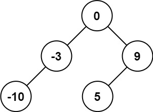

# LeetCode 108. Convert Sorted Array to Binary Search Tree
链接: https://leetcode.com/problems/convert-sorted-array-to-binary-search-tree/description/?envType=study-plan&id=level-2
## 题意
给定一个整数数组 nums，其中元素按升序排序，将其转换为 **高度平衡的** 二叉搜索树。
## 示例


输入: nums = [-10,-3,0,5,9]

输出: [0,-3,9,-10,null,5]
解释: [0,-10,5,null,-3,null,9] is also accepted:


## 思路
1. 二叉搜索树的左子树的值都小于根节点的值，右子树的值都大于根节点的值, 又因为数组是升序的, 所以我们可以取数组的中间值作为根节点，然后递归的构建左右子树。
2. 设置两个指针`low`和`high`，分别指向数组的头和尾，然后取中间值作为根节点，然后递归的构建左右子树。
3. 递归的终止条件是`low > high`，这时候返回`null`。
4. 每个节点的高度差不超过1，所以我们可以用前序遍历的方式构建二叉树, 先创建根节点，再创建左子树, 最后创建右子树。
## 代码
```go
func sortedArrayToBST(nums []int) *TreeNode {
	return dfs(nums, 0, len(nums)-1)
}

func dfs(nums []int, low, high int) *TreeNode {
	if low > high {
		return nil
	}
	mid := (low + high) / 2 // 取中间值作为根节点
	node := &TreeNode{Val: nums[mid]} // 创建根节点
	node.Left = dfs(nums, low, mid-1) // 递归的构建左子树
	node.Right = dfs(nums, mid+1, high) // 递归的构建右子树
	return node
}
```