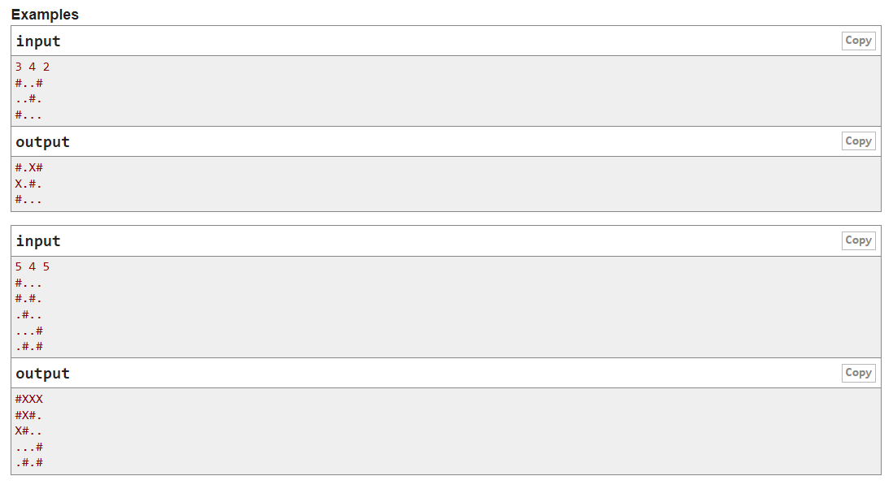

# CodeForces 377A Maze
## 题意 
小P非常的喜欢方格迷宫。方格迷宫是一个n*m的由墙和空地构成的长方形方阵。只有当两点满足四联通条件时才能走过去。

小P画了一个迷宫，里面所有的空地都是四连通的。但闲着没事干的小P认为自己画的迷宫里小墙太多了很难看，所以他希望能够通过把迷宫中k个格子从空地变成墙但不破坏整张图的连通性（即仍然保持所有空地在一个四连通块中）

但是小P太蠢了做不来，请你帮助他。

**输入**： 第一行n,m,k（描述如题） 第二到n+1行： 每行m个字符，分别是'.'或'#'。 '.'表示空地，'#'表示墙。 

**输出**： 把整张图原样打出来，但是被你修改的格子输出'X'。



## 思路
1. 逆向思维, 先把所有的空地变为墙, 然后从任意一个墙开始dfs, 找到一条连通的路径, 将这条路径上的墙变为空地, 直到用完k个墙.
2. 由于k是墙的数量, 所以用空地的数量减去k就是可以把墙变为空地的数量.
3. 由于题目保证了必有一个解, 所以只需要从任意一个空地开始dfs, 就能找到一条连通的路径.

## 代码
```go
package main

import (
	"bufio"
	"fmt"
	"os"
)

var n, m, k int
var maze [][]byte
var dir = [][]int{ // 方向向量
	{-1, 0},
	{1, 0},
	{0, -1},
	{0, 1},
}

func main() {
	gin := bufio.NewReader(os.Stdin)
	gout := bufio.NewWriter(os.Stdout)
	defer gout.Flush()

	fmt.Fscan(gin, &n, &m, &k)
	maze = make([][]byte, n+5)

	pointCount := 0 // 空地的数量

	for i := 1; i <= n; i++ {
		var line string
		fmt.Fscan(gin, &line)
		maze[i] = make([]byte, m+5)

		for j := 1; j <= m; j++ {
			if line[j-1] == '.' { 
				maze[i][j] = 'X' // 空地变为墙
				pointCount++ // 空地的数量加一
			} else {
				maze[i][j] = line[j-1] 
			}
		}
	}

	k = pointCount - k // 可以把墙变为空地的数量

	for i := 1; i <= n; i++ {
		for j := 1; j <= m; j++ {
			if maze[i][j] == 'X' { // 从任意一个墙开始dfs
				dfs(i, j) // 找到一条连通的路径
                // 打印结果
				for l := 1; l <= n; l++ {
					fmt.Fprintln(gout, string(maze[l][1:m+1]))
				}

				return
			}
		}
	}
}

func dfs(row, col int) {
	if row > n || row < 1 || col < 1 || col > m || k <= 0 || maze[row][col] != 'X' {
		return
	}
    
	// 因为只需要找到一条连通的路径, 所以不用恢复状态
	k--
	maze[row][col] = '.'

	for i := 0; i < 4; i++ {
		nx := dir[i][0] + row
		ny := dir[i][1] + col
		dfs(nx, ny)
	}
}

```