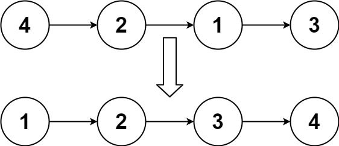

# LeetCode 148. Sort List
## 题目描述
一个单向链表, 依据结点的值对其进行从小到大排序, 要求时间复杂度为O(nlogn), 空间复杂度为O(1)

图例:


## 思路
1. 采用**归并排序**的思想, 将链表分成两部分, 分别对两部分进行排序, 然后将两部分合并
2. 首先, 采用快慢指针的方法, 找到链表的中间结点
3. 然后, 递归的对两部分进行排序, 第一部分是头结点到中间结点的前一个结点, 第二部分是中间结点到尾结点
4. 最后, 将两部分合并, 合并的方法是, 依次比较两部分的结点值, 将较小的结点插入到新链表中, 直到其中一部分的结点全部插入到新链表中, 然后将另一部分的结点全部插入到新链表中
5. 递归的终止条件是, 当链表为空或者链表只有一个结点时, 不需要排序, 直接返回链表即可

## 归并排序
归并排序是一种分治算法, 采用分治的思想, 将一个大问题分解成若干个小问题, 然后递归的解决这些小问题, 最后将这些小问题的解合并成大问题的解


## 代码
```go
type ListNode struct {
	Val  int
	Next *ListNode
}

func sortList(head *ListNode) *ListNode {
	if head == nil || head.Next == nil { // 递归的终止条件
		return head
	}

	slow, fast := head, head
	var mid *ListNode
	for fast != nil && fast.Next != nil { // 找到链表的中间结点
		mid = slow
		slow = slow.Next
		fast = fast.Next.Next
	}
	mid.Next = nil // 将第一个链表断开

	list1 := sortList(head) // 递归的对两部分进行排序
	list2 := sortList(slow)

	return merge(list1, list2) // 合并两个有序链表
}

func merge(list1, list2 *ListNode) *ListNode {
	if list1 == nil { // 合并两个有序链表
		return list2
	}
	if list2 == nil { // 合并两个有序链表
		return list1
	}

	head := &ListNode{} // 新链表的头结点
	rear := head        // 新链表的尾结点
	p1, p2 := list1, list2

	for ; p1 != nil && p2 != nil; rear = rear.Next {
		if p1.Val < p2.Val { // 依次比较两部分的结点值, 将较小的结点插入到新链表中
			rear.Next = p1
			p1 = p1.Next
		} else if p1.Val >= p2.Val {
			rear.Next = p2
			p2 = p2.Next
		}
	}

	if p1 != nil { // 将剩余的结点插入到新链表中
		rear.Next = p1
	}
	if p2 != nil {
		rear.Next = p2
	}

	return head.Next // 返回新链表的头结点的下一个结点
}

```