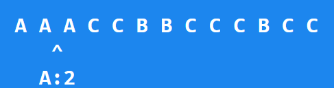

# 线性时间多数投票算法
论文链接: https://www.cs.utexas.edu/~moore/best-ideas/mjrty/index.html
## 问题描述
给定一个数组，其中有一个元素出现的次数超过了数组长度的一半，找出这个元素——多数元素。

**注意**: 
1. 假设数组长度为n, 那么长度的一半为`n/2`向下取整
2. 假设数组中始终存在多数元素

## 算法描述
1. 初始化候选元素`candidate`为`None`, 候选元素出现的次数`count`为0
2. 遍历数组中的每个元素`x`
    1. 如果`count`为0, 则将`x`赋值给`candidate`, 并将`count`置为1
    2. 如果`x`等于`candidate`, 则`count`加1, 否则`count`减1
3. 返回`candidate`

## 图示

维护一个`candidate:count`的结构, 遍历数组.


初始化`candidate`为`None`, `count`为0


前进一步， `candidate`为`A`, `count`为1



前进一步， `candidate`为`A`, `count`为2


前进一步， `candidate`为`A`, `count`为3


前进一步, 遇到`C`, `candidate`为`A`, `count`减一为2


前进一步, `candidate`为`C`, `count`减一为1


前进一步, `count`减一为0, 所以`candidate`变为`None`


`candidate`为`B`, `count`为1


`candidate`为`None`, `count`为0


`candidate`为`C`, `count`为1


`candidate`为`C`, `count`为2


`candidate`为`C`, `count`为1


`candidate`为`C`, `count`为2

最后返回`C`

## 代码
### C++
```cpp
class Solution {
public:
    int majorityElement(vector<int>& nums) {
        int candidate = nums[0];
        int count = 1;

        for (int i = 1; i < nums.size(); i++) {
            if (count == 0) {
                candidate = nums[i];
                count++;
            } else if (nums[i] == candidate) {
                count++;
            } else {
                count--;
            }
        }

        return candidate;
    }
};
```
### Go
```go
func majorityElement(nums []int) int {
    major := nums[0]
    count := 1

    for _, num := range nums[1:] {
        if num == major {
            count++
        } else if count == 0 {
            major = num
            count++
        } else {
            count--
        } 
    }

    return major
}
```